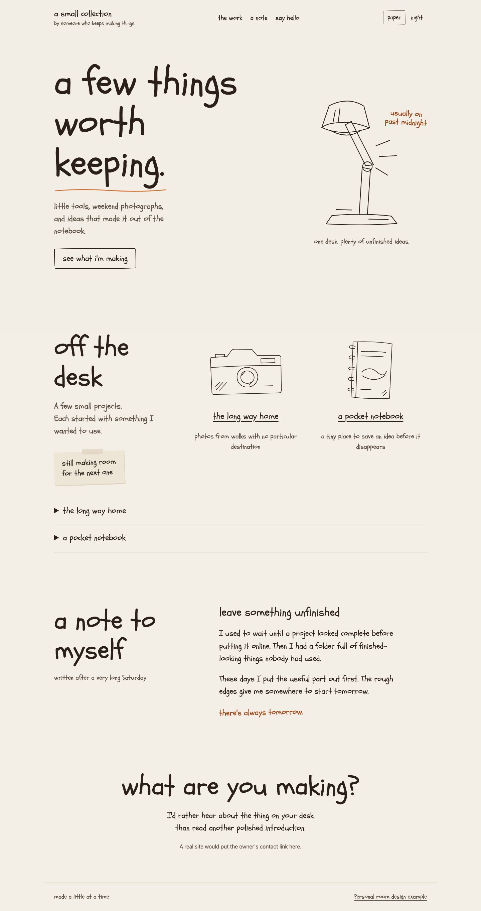
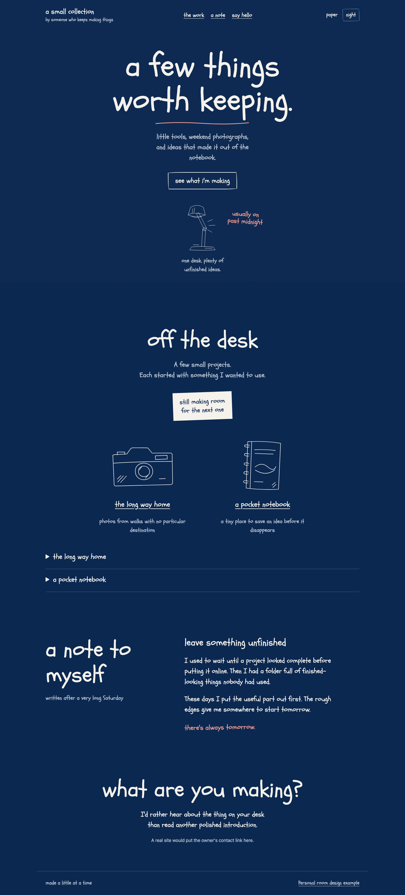
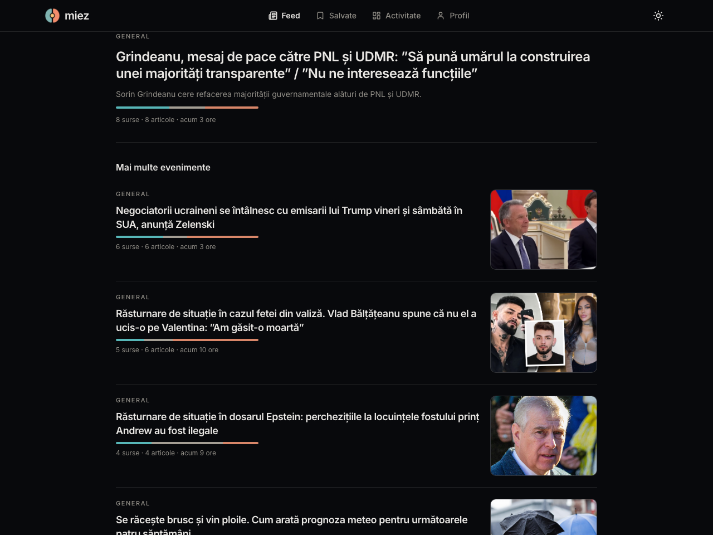
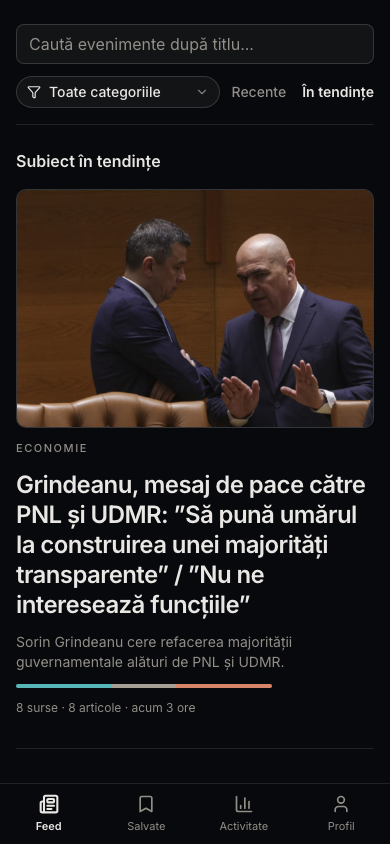
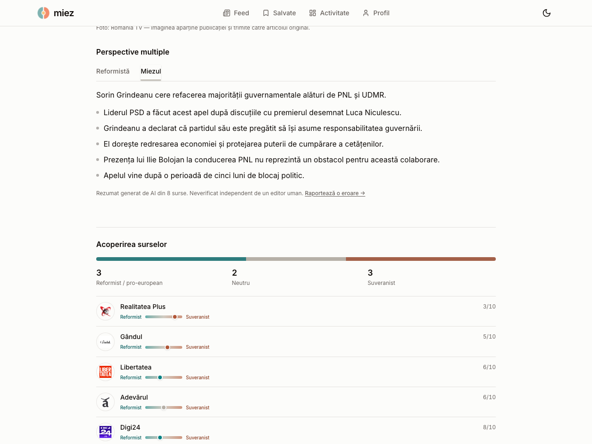
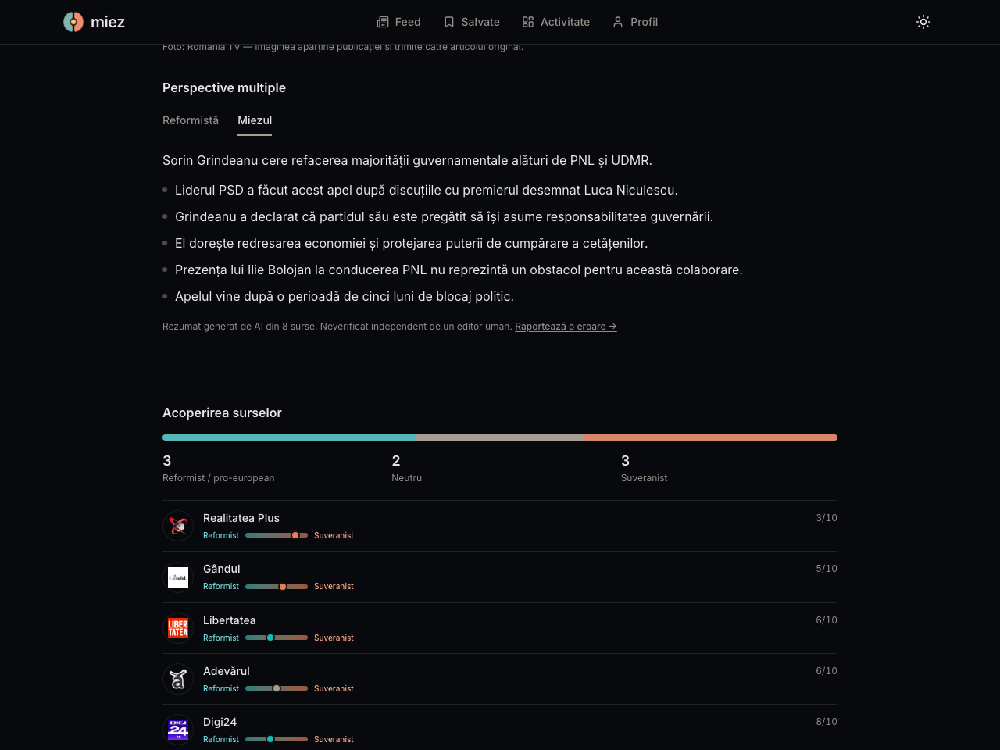

# Flavius design taste

My design taste as two reusable skills for AI agents. Choose a direction for the project; each works without a framework or model API.

- [Editorial calm](skills/editorial-calm/SKILL.md) is for app interfaces with restrained typography, warm neutrals and separated rows.
- [Personal room](skills/personal-room/SKILL.md) is for personal sites, portfolios, communities and expressive screens. Handwriting, meaningful objects, imperfect outlines and a conversational voice give it character.

Personal room draws on my [portfolio](https://flavius.pro) and [Cluj House](https://clujhouse.com/). It adds warm paper and navy poster directions. The [source notes](skills/personal-room/references/sources.md) explain the extraction and adaptations. Editorial calm keeps its existing guidance and assets.

## Choose the direction

| The job | Starting direction |
| --- | --- |
| Repeated task work, settings, dashboards or dense tools | Editorial calm. Keep navigation and controls predictable. |
| A personal collection, portfolio or small community | Personal room. Choose its objects and voice from the subject. |
| An article or notes within either project | Keep the chosen palette and title voice, then use a readable prose role. |
| A practical screen inside a Personal room project | Keep its identity while using upright labels and conventional controls. |

A project's chosen direction and the user's brief take precedence over these starting points. The tastes describe visual decisions, not a mandatory page template. Give one taste responsibility for page typography, colour and layout when combining them.

## Personal room





Open the [interactive example](examples/personal-room/index.html) locally to try both palettes and the project stories. The example uses original drawings and fictional content. Its palette switch is for comparison; a finished site can choose one direction.

Ask your agent:

> Read `skills/personal-room/SKILL.md` and use Personal room for this project. Choose objects and a voice that belong to its subject, then apply the paper or night direction. Preserve the product behaviour.

Install the whole `skills/personal-room` folder in `~/.codex/skills/personal-room` for Codex or `.claude/skills/personal-room` for Claude Code. Other agents can read the Markdown directly. The folder includes the [portable tokens](skills/personal-room/assets/tokens.json), [generated CSS](skills/personal-room/assets/tokens.css), [optional font stylesheet](skills/personal-room/assets/fonts.css) and [implementation guide](skills/personal-room/references/implementation.md). It does not depend on the Editorial calm folder. The [repair notebook](eval/cycles/12/index.html) shows the same taste on a reading and editing screen, without an illustrated room.

Schoolbell is bundled under the [Apache License 2.0](skills/personal-room/assets/fonts/LICENSE.txt). Reference photos, music artwork and logos are not part of this package.

## Editorial calm

Content sits on the page. Typography, whitespace and hairlines establish hierarchy. Warm neutrals and graphite actions give the interface its character. Colour carries meaning. Boxes need a reason to exist.

## The look

Real app screens in light and dark themes. Readable headlines, quiet navigation, separated rows and clear section hierarchy share the page background.

### Light


### Dark



### On a smaller screen

Navigation adapts, rows wrap and controls keep their touch targets. The visual hierarchy stays the same.

<p>
  
  
</p>

These are screenshots from a live app, not generated mockups. They show one application of the taste; its branding, content and domain colours are specific to that app. The mobile previews show responsive web; native implementations use their own platform controls.

### Detail and reading





See the [capture notes](examples/screenshots/README.md) for provenance. The separate [browser example](examples/index.html) is a generic workspace you can open locally to try the themes and controls.

## Give it to an agent

Clone this repository into your project or a shared tools directory. Ask your agent:

> Read `skills/editorial-calm/SKILL.md` and use Flavius design taste for this app. Read the reference for my platform. Preserve the product's behaviour and use this system for its visual decisions.

Agents that support skills can install the `skills/editorial-calm` folder in their skill directory. For Codex, copy it into `~/.codex/skills/editorial-calm`. For Claude Code, copy it into `.claude/skills/editorial-calm` in your project. Agents without skill support can read the Markdown directly. No model API or build dependency is required.

## Works well with shadcn/ui

This taste combines well with [shadcn/ui](https://ui.shadcn.com). Its [CSS variable theming](https://ui.shadcn.com/docs/theming) uses the same semantic roles, including `background`, `foreground`, `primary`, `muted`, `border` and `ring`, with `.dark` overrides.

Use shadcn/ui for buttons, inputs, dialogs, menus and other controls. Apply this taste to the page layout, typography, spacing and choice of surfaces. Ordinary sections stay on the page; a dialog earns its own surface.

Copy the token values into your existing theme or import `tokens.css` after the default theme definitions. Keep your Tailwind semantic mappings and dark-mode setup. Map the component radii to the supplied control, media and overlay values. Charts and sidebars may need additional app-specific tokens. The [web guide](skills/editorial-calm/references/web.md) covers the integration.

shadcn/ui is optional. The skill and tokens also work with other component libraries and native controls.

## Use the assets

- [tokens.json](skills/editorial-calm/assets/tokens.json) is the portable source of truth.
- [tokens.css](skills/editorial-calm/assets/tokens.css) provides CSS custom properties.
- [tokens.srgb.json](skills/editorial-calm/assets/tokens.srgb.json) provides colours for platforms without OKLCH support.
- [fonts.css](skills/editorial-calm/assets/fonts.css) loads the bundled Inter variable fonts, covering Latin and Latin Extended text.
- [Reference assets](examples/reference-assets/README.md) include the live app logo for visual reference.
- [Web guide](skills/editorial-calm/references/web.md) covers browser implementations.
- [Mobile guide](skills/editorial-calm/references/mobile.md) covers React Native, SwiftUI and Compose.
- [Desktop guide](skills/editorial-calm/references/desktop.md) covers desktop layouts and interaction.

Edit the relevant skill's `assets/tokens.json` first. Run `node scripts/build.mjs` to regenerate both skills' CSS and Editorial calm's portable sRGB values. Run `node scripts/check.mjs` to verify generated assets, links, palette contrast and font packaging.

## Tested with agents

The [evaluation log](eval/README.md) records build, review and fix cycles. The first ten used independent agents; later cycles identify self-review explicitly. It includes working screens, builder notes, findings, browser checks and screenshots. These exercises test how the tastes transfer to different tasks, including enlarged text and both themes. The [research notes](eval/research/2026-10-09.md) compare seven design-skill repositories, published designer methods and primary accessibility guidance. They explain which ideas fit this repo and which were excluded.

## Verify a change

The installed skill folders work without repository tooling. Maintainers can run the following checks from this repository:

```sh
node scripts/build.mjs
node scripts/check.mjs
npm ci
npx playwright install chromium firefox webkit
npm run test:tooling
npm run check:browser -- --output .artifacts/browser
npm run check:browser -- --browser firefox --output .artifacts/browser-firefox
npm run check:browser -- --browser webkit --output .artifacts/browser-webkit
```

The browser runner checks both specimens and the repair notebook at 320px, 390px, 768px and 1440px, then applies all-text enlargement, spacing overrides and forced-colour substitution. It also inspects the invitation preview while open, including a 480px-tall viewport with enlarged text. It tests interactions and writes screenshots plus a report with source hashes. The default engine is Chromium. CI runs the same suite in Chromium, Firefox and WebKit and retains separate artifacts. Each report identifies its engine, version and measured emulation capabilities. Conditions that the engine cannot reproduce stay explicitly unverified. WebKit can match the forced-colour media query without replacing the palette; that run checks the media rules and does not claim colour substitution. Visual composition, images and screen readers still require their own review.

Browser and native runners capture their input bytes before testing. Browsers receive those captured assets, and native builds compile and package the captured files. Report hashes identify those bytes even if the working tree changes during a run. This is a per-file capture, not an atomic Git checkout or a claim that every screenshot or binary is reproducible byte for byte. `python3 -m unittest discover -s scripts/tests -p 'test_*.py'` checks native capture and project packaging without Xcode; these fixtures also run in CI.

On macOS with Xcode and an available iOS simulator runtime, `npm run check:native -- --output .artifacts/native-room` compiles the [native Personal room specimen](eval/cycles/15/index.html). It creates and removes an isolated simulator, checks ordinary and largest accessibility text, tests live size changes, and captures the results. The skill folders do not depend on this tooling. Simulator layout and programmatic control events do not establish physical-device gestures or VoiceOver behavior.

`npm run check:native-ui -- --output .artifacts/native-ui` adds XCTest swipes, taps and unfiltered accessibility audits at ordinary and largest text sizes in both appearances. It retains full Xcode result bundles and screenshots. Choose a fresh output directory for each run. These tests still need separate VoiceOver and physical-device review. Add `--without-font` to either native command to build without Schoolbell and check the system-font fallback. The ordinary build still requires the expected custom face to load.

## What belongs to Editorial calm

Warm neutral backgrounds, graphite actions, semibold hierarchy, sentence case, readable prose, separated rows, stable navigation and short motion. Settings, forms and statistics belong on the page too.

Choose content, navigation and domain colours for the app you're building. Dense operator tools may use bordered groups when their interaction needs them; a route name alone does not earn a box.

## Licence

Licensed under MIT. Commercial and closed-source use is permitted. Include the copyright and permission notice in copies or substantial portions of the software. See [LICENSE](LICENSE). Bundled Inter fonts have their own [SIL Open Font License](skills/editorial-calm/assets/fonts/OFL.txt). Screenshots contain app content and publisher imagery for visual reference; the MIT licence does not relicense third-party material shown in them.
