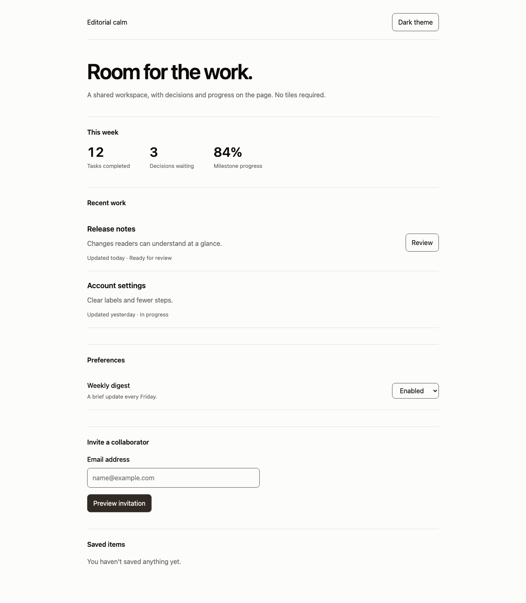

# Flavius design taste

Flavius Cojocaru's design taste, extracted from Miez. For web, mobile and desktop apps.

Content sits on the page. Typography, whitespace and hairlines establish hierarchy. Boxes need a reason to exist. Actions use warm graphite, and colour carries meaning.

## Give it to an agent

Clone this repository into your project or a shared tools directory. Ask your agent:

> Read `skills/editorial-calm/SKILL.md` and use Editorial calm for this app. Read the reference for my platform. Preserve the product's behaviour and use this system for its visual decisions.

Agents that support skills can install the `skills/editorial-calm` folder in their skill directory. For Codex, copy it into `~/.codex/skills/editorial-calm`. For Claude Code, copy it into `.claude/skills/editorial-calm` in your project. Agents without skill support can read the Markdown directly. No model API or build dependency is required.

## Use the assets

- `skills/editorial-calm/assets/tokens.json` is the portable source of truth.
- `skills/editorial-calm/assets/tokens.css` provides CSS custom properties.
- `skills/editorial-calm/references/web.md` covers browser implementations.
- `skills/editorial-calm/references/mobile.md` covers React Native, SwiftUI and Compose.
- `skills/editorial-calm/references/desktop.md` covers desktop layouts and interaction.
- `examples/index.html` is a working browser specimen with light and dark themes.

Run `node scripts/build.mjs` to regenerate CSS and portable sRGB values. Run `node scripts/check.mjs` to verify the package. Open `examples/index.html` in a browser to inspect the specimen.

## What belongs to this taste

Warm neutral backgrounds, graphite actions, semibold hierarchy, ordinary sentence case, readable prose, separated rows, stable navigation and short motion. Settings, forms and statistics belong on the page too.

Miez's political spectrum, news taxonomy, translations, analytics and backend are product decisions. They are excluded. Operator tools may use bordered groups when their density or manipulation needs them; an `/admin` path alone does not earn a box.

## Origin and licence

Extracted from the live Miez palette, its Editorial calm skill and its web and native design decisions. The older web guide described a blue accent; this package follows the current graphite palette. Section headings use sentence case, superseding the native log's earlier uppercase treatment.

Licensed under 0BSD. Use, copy, modify and redistribute it for any purpose, including commercial and closed-source projects. Attribution and retention of the licence notice are not required. See `LICENSE`. Font binaries and third-party UI implementations are not included.
